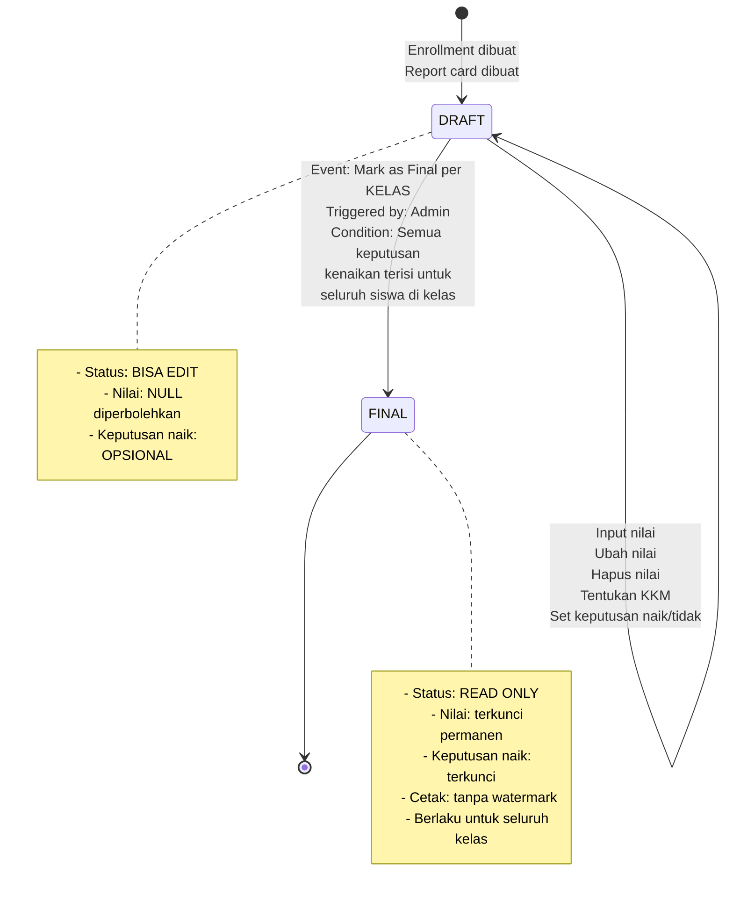
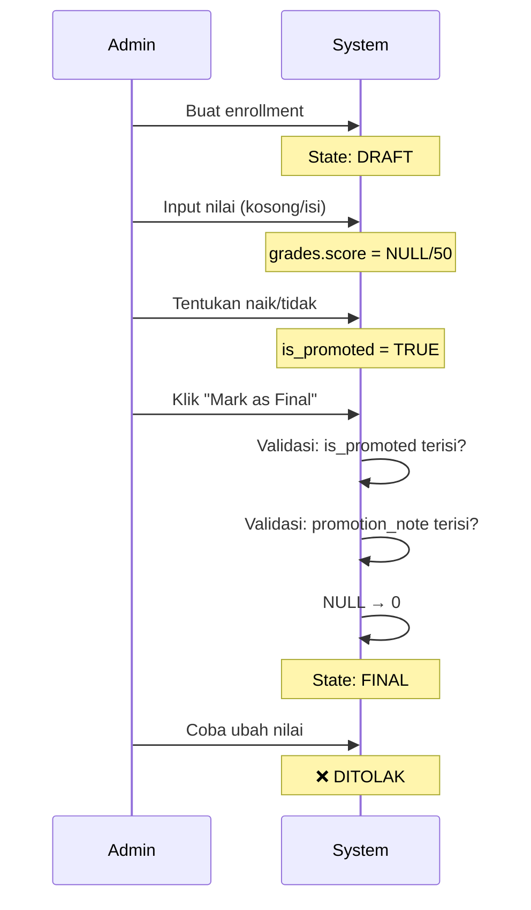
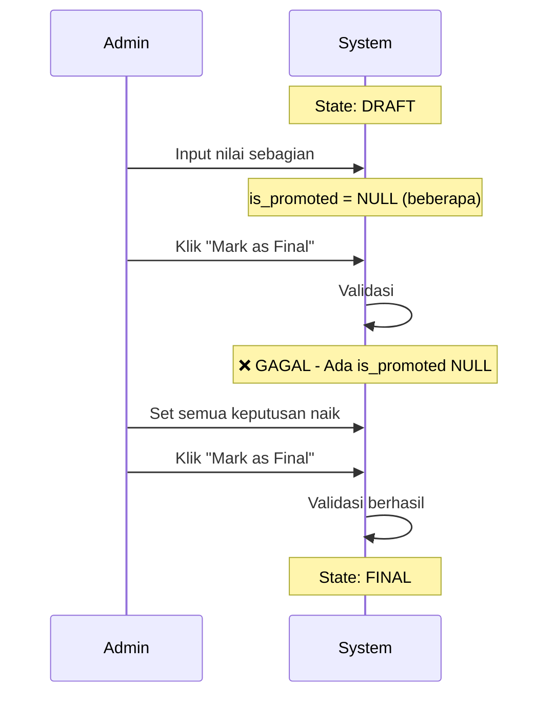

# Data Lifecycle / State Machine

Dokumen ini menjelaskan perjalanan data dalam sistem raport akademik dari tahap pembuatan hingga penguncian permanen.

---

## 1. Diagram State Machine

---

## 2. Entitas dengan State Machine

Hanya **`report_cards`** yang memiliki state machine dalam sistem ini.

Catatan: Finalisasi dilakukan PER KELAS (per class_academic_year). Ketika admin mengklik "Mark as Final", SEMUA report_cards untuk seluruh siswa di kelas tersebut akan berubah ke status FINAL.

| Entitas | State | Field Penentu |
|---------|-------|---------------|
| report_cards | DRAFT / FINAL | is_finalized = false / true |

---

## 3. State: DRAFT

### 3.1 Deskripsi
State DRAFT adalah kondisi awal semua raport. Pada state ini, data masih dapat diubah secara bebas oleh Admin.

### 3.2 Siapa yang Bisa Mengubah
- **Admin** - Satu-satunya pengguna dengan akses penuh

### 3.3 Event yang Mengubah Data

| Event | Action | Target |
|-------|--------|--------|
| Input nilai pertama | INSERT | grades |
| Ubah nilai | UPDATE | grades |
| Hapus nilai | DELETE / SET NULL | grades |
| Tentukan KKM | UPDATE | class_subjects |
| Set keputusan naik | UPDATE | report_cards.is_promoted |
| Set catatan naik | UPDATE | report_cards.promotion_note |
| Tambah mapel | INSERT | class_subjects |
| Hapus mapel | DELETE | class_subjects |

### 3.4 Apa yang BISA Dilakukan

| Operasi | Status |
|---------|--------|
| Input nilai baru | ✓ Diizinkan |
| Ubah nilai yang sudah ada | ✓ Diizinkan |
| Kosongkan nilai (NULL) | ✓ Diizinkan |
| Tentukan status naik/tidak | ✓ Diizinkan |
| Ubah catatan keputusan | ✓ Diizinkan |
| Cetak raport | ✓ Diizinkan (dengan watermark DRAFT) |
| Hapus enrollment | ✓ Diizinkan (jika belum final) |
| Tambah mapel di kelas | ✓ Diizinkan |

### 3.5 Apa yang TIDAK BISA Dilakukan

| Operasi | Alasan |
|---------|--------|
| Cetak tanpa watermark | Belum final |
| Mengunci permanen | Harus finalisasi dulu |

### 3.6 Kondisi Khusus Saat DRAFT

| Field | Aturan |
|-------|--------|
| grades.score | Boleh NULL |
| report_cards.is_promoted | Boleh NULL |
| report_cards.promotion_note | Boleh NULL |
| class_subjects.kkm | Boleh diubah |

---

## 4. State: FINAL

### 4.1 Deskripsi
State FINAL adalah kondisi terkunci permanen. Setelah mencapai state ini, data tidak dapat diubah oleh pihak manapun termasuk Admin.

### 4.2 Siapa yang Bisa Mengubah
- **TIDAK ADA** - Data terkunci permanen

### 4.3 Event yang Mengubah State

| Event | Trigger | Pre-condition |
|-------|---------|---------------|
| Mark as Final per Kelas | Admin klik tombol "Mark as Final" di halaman kelas | Semua is_promoted terisi untuk seluruh siswa Semua promotion_note terisi untuk seluruh siswa |

### 4.4 Apa yang TIDAK BISA Dilakukan (Semua DITOLAK)

| Operasi | Respons Sistem |
|---------|-----------|
| INSERT nilai baru | ❌ Ditolak - Data terkunci |
| UPDATE nilai | ❌ Ditolak - Data terkunci |
| DELETE nilai | ❌ Ditolak - Data terkunci |
| UPDATE is_promoted | ❌ Ditolak - Data terkunci |
| UPDATE promotion_note | ❌ Ditolak - Data terkunci |
| DELETE enrollment | ❌ Ditolak - Sudah punya raport |
| UPDATE KKM | ❌ Ditolak - Sudah ada nilai |
| DELETE class_subjects | ❌ Ditolak - Sudah ada nilai |
| INSERT class_subjects | ❌ Ditolak - Raport sudah final |

### 4.5 Apa yang TETAP BISA Dilakukan

| Operasi | Catatan |
|---------|--------|
| Cetak raport | Tanpa watermark DRAFT |
| View data | Read-only |
| Export data | Read-only |

### 4.6 Automatic Changes Saat Finalisasi

| Sebelum Final | Sesudah Final |
|---------------|---------------|
| grades.score = NULL | grades.score = 0 |
| is_finalized = false | is_finalized = true |
| finalized_at = NULL | finalized_at = timestamp |
| finalized_by = NULL | finalized_by = teacher_id |

---

## 5. Matriks State Transitions

### 5.1 Valid Transitions

| Dari State | Event | Menuju State | Catatan |
|------------|-------|---------------|---------|
| DRAFT | Mark as Final | FINAL | Irreversible |
| FINAL | - | - | Tidak ada transisi keluar |

### 5.2 Invalid Transitions (DITOLAK)

| Dari State | Event | Respons Sistem |
|------------|-------|---------------|
| FINAL | Update nilai | ❌ Ditolak - Data terkunci |
| FINAL | Delete enrollment | ❌ Ditolak - Sudah ada raport |
| FINAL | Mark as Final | ❌ Ditolak - Sudah final |
| FINAL | Apa saja | ❌ Ditolak - Read only |

---

## 6. Matriks Izin per State

### 6.1 Operasi pada report_cards

| Operasi | DRAFT | FINAL |
|---------|-------|-------|
| SELECT | ✓ | ✓ |
| UPDATE is_promoted | ✓ | ❌ |
| UPDATE promotion_note | ✓ | ❌ |
| UPDATE is_finalized | ❌ | ❌ |

### 6.2 Operasi pada grades

| Operasi | DRAFT | FINAL |
|---------|-------|-------|
| SELECT | ✓ | ✓ |
| INSERT | ✓ | ❌ |
| UPDATE | ✓ | ❌ |
| DELETE | ✓ | ❌ |

### 6.3 Operasi pada student_enrollments

| Operasi | DRAFT | FINAL |
|---------|-------|-------|
| SELECT | ✓ | ✓ |
| INSERT | ✓ | ❌ |
| DELETE | ✓ | ❌ |

### 6.4 Operasi pada class_subjects

| Operasi | DRAFT | FINAL |
|---------|-------|-------|
| SELECT | ✓ | ✓ |
| INSERT | ✓ | ❌ |
| UPDATE kkm | ✓ | ❌ |
| DELETE | ✓ | ❌ |

---

## 7. Validasi Sebelum Finalisasi

Sebelum transisi DRAFT → FINAL (per kelas), sistem WAJIB memvalidasi:

| Validasi | Status | Aksi Jika Gagal |
|----------|--------|-----------------|
| Semua is_promoted tidak NULL untuk seluruh siswa | WAJIB | ❌ Finalisasi ditolak |
| Semua promotion_note tidak NULL untuk seluruh siswa | WAJIB | ❌ Finalisasi ditolak |
| Semua mapel memiliki baris grades | NULL → 0 | ✓ Otomatis diubah |

---

## 8. Contoh Perjalanan Data

### Skenario 1: Alur Normal

### Skenario 2: Gagal Finalisasi

---

## 9. Referensi Aturan Bisnis

| Konsep | Referensi KITAB-ATURAN |
|--------|----------------------|
| Nilai boleh kosong saat draft | Pasal 13 ayat (4) |
| NULL jadi 0 saat final | Pasal 16 ayat (4) |
| Setelah final tidak boleh ubah | Pasal 14 ayat (2) |
| Keputusan naik wajib ada sebelum final | Pasal 20 ayat (2) |
| Finalisasi irreversibel | Pasal 23 ayat (4) |
| Larangan ubah data setelah final | Pasal 28 ayat (1) |
| Nilai kepribadian boleh NULL saat draft | Pasal 26A ayat (4) |
| Kehadiran terkunci setelah final | Pasal 26B ayat (4) |

---

## 10. Ringkasan Cepat

| Aspek | DRAFT | FINAL |
|-------|-------|-------|
| **Status** | Bisa edit | Read only |
| **Nilai NULL** | Diizinkan | Diubah ke 0 |
| **Keputusan Naik** | Opsional | Wajib terisi |
| **Cetak** | Watermark DRAFT | Tanpa watermark |
| **Ubah Data** | ✓ | ❌ DITOLAK |
| **Undo** | ✓ | ❌ TIDAK MUNGKIN |

---

*Dokumen ini bagian dari spesifikasi sistem raport akademik.*
